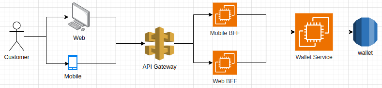

# Desafio picpay

Este projeto é uma API Rest que simula uma carteira digital, realizando operações como transferência, deposito e saque.

## Tecnologias
- Kotlin
- Spring Boot
- H2 Database
- Java 17

## Como executar

### Usando imagem Docker
1. Faça pull da imagem do projeto
```bash
docker pull donatowill/picpay-wallet:1.0
```
2. Execute a imagem docker
```bash
docker run -d -p 8080:8080 donatowill/picpay-wallet:1.0
```
3. A aplicacao estara disponivel na url http://localhost:8080

### Clonando projeto
1. Clone o repositorio
```bash
git clone https://github.com/DonatoWill/desafio-picpay.git
```

2. Instale as dependencias com gradle
```bash
./gradlew build
```

3. Inicie o projeto
```bash
./gradlew bootRun
```

4. A aplicacao estara disponivel na url http://localhost:8080

## API Endpoints
O serviço fornece documentação das APIs através do swagger que pode ser acessado pela url http://localhost:8080/swagger-ui/index.html


## Desenho integração Web e Mobile
